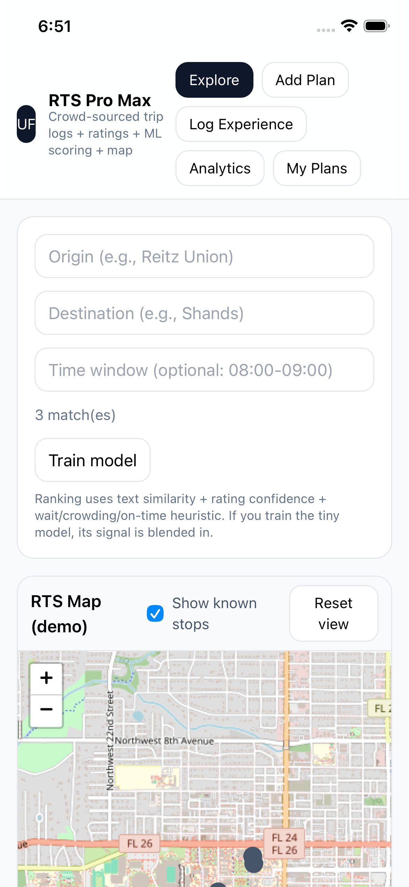
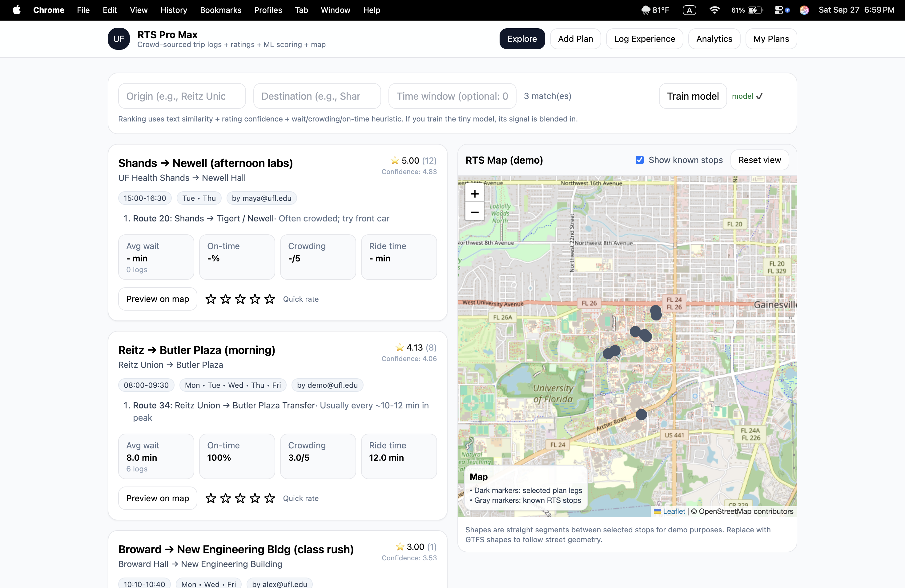
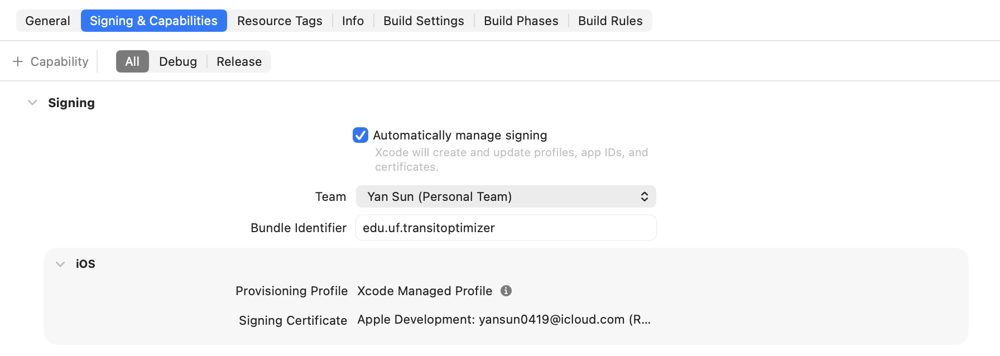

# RTS Pro Max

An MVP for optimizing campus transit at UF: **user-created trip plans + experience logs + ratings + a tiny ML scorer + intelligent trip planning**.  
Single-file web app (React + Tailwind + Leaflet + TensorFlow.js) packaged for iOS via **Capacitor**.

<!-- >  -->

<center>
  
</center>

---

## ✨ Features

1. People-in-the-loop app. We started with simple trip planning, then added a two-way feedback loop: riders share quick, one-tap feedback, and the AI sends back smarter, more relevant suggestions.
2. Hybrid model that learns. We mix hard data (wait time, delays, crowding, on-time rate) with soft signals (ratings, comments). A time-and-place aware regression powers recommendations by when you travel and where you start. As new logs roll in, the cloud model retrains so suggestions keep getting sharper.
3. From better rides to better ops. The same signals highlight where to tweak service—headways, vehicle shifts, staggered departures—and even point to future route re-org ideas. Think reinforcement-style learning: learn from outcomes, then nudge the schedule in the right direction.

---

## 🧱 Tech Stack

- **React 18 (UMD)** & **ReactDOM 18 (UMD)**
- **Tailwind CSS** (CDN)
- **Leaflet 1.9.x** (OSM tiles)
- **TensorFlow.js 4.x** (tiny 1-hidden-layer regressor)
- **Capacitor 6** (`@capacitor/core`, `@capacitor/cli`, `@capacitor/ios`) for iOS wrapper

---

## 🚀 Run in Browser (for quick dev)

1. Clone:
   ```bash
   git clone https://github.com/yansun0419-ux/rts-pro-max.git
   cd rts-pro-max
   ```

2. Open `public/index.html` directly, **or** serve it locally:
   ```bash
   # pick one
   npx http-server public -p 5173
   # or
   python3 -m http.server --directory public 5173
   ```
   Visit `http://localhost:5173`.

<center>
  
</center>

---

## 📱 Build for iOS with Capacitor

> **Prereqs:** Xcode installed, signed in with your Apple ID. Connect your iPhone to your Mac (enable Developer Mode on device).

1. Install deps:
   ```bash
   npm i @capacitor/core @capacitor/cli @capacitor/ios
   ```

2. (If you haven’t initialized yet)
   ```bash
   npx cap init "UF Transit Optimizer" "edu.uf.transitoptimizer" --web-dir=public
   ```

3. Add iOS (one time):
   ```bash
   npx cap add ios
   ```

4. **Every time** you change files under `public/`, sync web assets:
   ```bash
   npx cap copy ios    # or: npx cap sync ios
   ```

5. Open in Xcode and run:
   ```bash
   npx cap open ios
   ```
   In Xcode → **Targets ▸ Signing & Capabilities**:
   - Check **Automatically manage signing**
   - Choose your **Team** (Personal Team is fine)
   - Make sure **Bundle Identifier** is unique (e.g., `edu.uf.transitoptimizer.<yourname>`)

> 

### Trust the developer certificate on device (first run)

If you see “**Developer App Certificate is not trusted**”:
- On iPhone: **Settings → General → VPN & Device Management** (or **Profiles & Device Management**)
- Under **Developer App**, select your account → **Trust**.

---

## 🙌 Acknowledgments

- OpenStreetMap & Leaflet  
- TensorFlow.js  
- Capacitor & Ionic team  
- Everyone who tested and shared feedback
